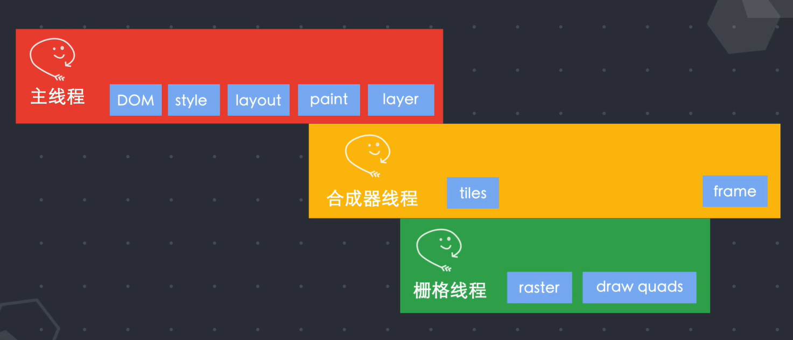

# web运行原理

---

## 一、互联网运作原理

---

### 1.客户端-服务端模型

> - 电脑连入互联网时会分配一个IP地址(Internet Protocol address)
>
> - 服务器接入互联网也分配一个IP地址
> - 客户端向服务端发送请求通过TCP/IP协议族实现数据的传输

### 2.TCP/IP协议族

分成4层

| 层         | 功能                                                         | 内容                                   |
| ---------- | ------------------------------------------------------------ | -------------------------------------- |
| 应用层     | 提供特定于应用程序的协议(浏-服通信HTTP、文传FTP、邮件检索IMAP...) | 数据包                                 |
| 传输控制层 | 发送数据包到计算机上使用特定端口号的应用程序                 | 数据包、源端口、目标端口               |
| IP网络层   | 使用IP地址将数据包发送到特定的计算机                         | 数据包、源端口、目标端口、源IP、目标IP |
| 数据链路层 | 将二进制数据包与网络信号相互之间转换                         | 将数据包的文本信息转译成电子信号       |

#### 一次交互

> - 使用HTTP协议请求获取数据 发送请求消息 发送前分解为许多片段-数据包
>
> - 进入传输控制层每个数据包会分配 源端口和目标端口
>
> - 进入IP层后，每个数据包将会赋予目标计算机的IP地址 数据过大时，在IP层会进行分包，每个数据包在链路层走的物理链路不一样，传输速度也不一样，导致乱序，但TCP会根据数据包上携带的序列号进行排序重组
> - 在数据链路层将数据包的文本信息转译成电子信号
> - 电缆传输
> - 数据包从TCP/IP协议族的底部开始向上运行 客户端添加的所有路由数据都将从数据包中剥离出来 到达栈顶恢复成最初的形式
> - 通过端口号可以将数据传递给当前服务器 监听该端口的应用程序 根据请求数据作出反应
> - 原路返回

#### TCP	

>是一种面向连接的可靠字节流服务协议
>
>- TCP必须三次握手建立连接之后才能交换数据
>
>- 每个收到的数据包都会向发送方 发送ack确认，以保证发送成功
>- 发送方在一个特定时间内没有接收到接收方的ack确认时、发送方会重新传送该数据包

#### IP	

> 是不可靠的无连接协议，不关心数据包是否到达、连接和端口号
>
> - 工作：发送数据包将其路由到目标计算机
> - 每个数据包都是独立的 互不依赖的
> - 有可能乱序到达地址 或者在传输中丢失(交给了TCP  体现了分层的作用)

#### IP地址	

> - IPv4(Internet Protocol version4)	32位(4字节)
> - IPv6    128位

### 3.广域(简化)

| 传输位置                       | 功能                                                         |
| ------------------------------ | ------------------------------------------------------------ |
| 本地计算机                     | 发送请求                                                     |
| 调制解调器(modem)              | 将数字信号翻译可沿普通电话线传送的模拟信号 在公共电话网络进行传输 |
| ISP(Internet Service Provider) | 接入互联网                                                   |
| regional ISP                   | 主干网络                                                     |
| NSP(Network Service Provider)  | 大型网络 网络服务提供商 为ISP提供服务的公司 批量提供带宽 为客户提供网络接入服务 连接NSP骨干网的路由器拥有最大的路由表 |
| NAP(网络访问点)                | NSP通过NAP交换数据包流量 每个NSP至少连接3个NAP               |
| 路由器                         | 互联网中的特殊计算器 路由表-记录其子网络的所有IP地址 并不知道上层网络包含的IP地址 找不到一直向上路由 |

#### DNS(Domain Names Service)域名解析

> 一个分布式数据库 记录了域名和其IP地址的对应关系
>
> - 在浏览器输入网址时 首先要连接DNS服务器
> - 获取到该域名的IP地址后再连接访问该IP的服务器
> - IP地址变化可以重新绑定域名 不影响访问

## 二、浏览器运作原理

---

### 1.发展历史

| 名称           | 年份 | 创建者      | 描述                                         | 内核    |
| -------------- | ---- | ----------- | -------------------------------------------- | ------- |
| World Wide Web | 1991 | Berners Lee |                                              |         |
| Mosaic         | 1993 |             | 显示图片                                     |         |
| 网景           | 1994 | 网景        | 静态html                                     |         |
| Opera          | 1994 |             |                                              | Blink   |
| IE1.0/2.0      | 1995 | 微软        |                                              | Trident |
| IE3.0          | 1996 | 微软        | 集成在Windows(此年网景市场86%) 99年IE占据99% | Trident |
| Mozilla基金会  | 1998 | 网景        | 开发开源项目Firefox                          | Gecko   |
| Safari         | 2003 | 苹果        |                                              | webkit  |
| Firefox1.0     | 2004 | 网景        |                                              | Gecko   |
| Safari         | 2005 | 苹果        | 开源了内核                                   | webkit  |
| Chromium项目   | 2008 | 谷歌        | 在webkit内核的基础上开发了Chrome             | Blink   |
| Edge           | 2015 | 微软        | 放弃IE采用webkit内核                         | Blink   |

### 2.基本结构

>- 用户界面 ：展示除标签页窗口之外的其他用户界面内容
>- 浏览器引擎：在用户界面和渲染引擎之间传递数据
>  - 数据持久层：帮助浏览器存储各种数据-	cookie
>- 渲染引擎(内核)：渲染用户请求的页面内容
>  - 网络模块：负责网络请求
>  - JS解析器：负责解析和执行JS

### 3.进程和线程

- 进程：操作系统进行资源分配和调度的基本单元，可以申请和拥有计算机资源，进程是程序的基本执行实体
- 线程：操作系统能够进行运算调度的最小单位，一个进程中可以并发多个线程，每条线程并行执行不同的任务

### 4.应用程序运行

- 创建进程来执行任务代码
  - 为该进程分配内存空间、该程序的状态都保存在该内存中、关闭时内存空间被收回
- 进程可以启动更多的进程来执行任务
  - 每个进程的内存空间是独立的
  - 进程通信可以通过通信管道IPC来传递
- 多进程结构避免一个进程的卡死影响整个应用程序
- 进程可以将任务分成更多细小的任务
  - 创建多个线程并行执行不同的任务
  - 同一进程下的线程之间可以直接通信共享数据

### 5.浏览器多进程结构

> 单进程缺点
>
> - 不稳定：一个卡死整个进程不能执行
> - 不安全：子线程可以访问所有数据
> - 不流畅：一个进程需要负责所有事情导致运行效率低

结构：

- 浏览器进程：控制除标签页外的用户界面-地址栏、书签、后退前进按钮，以及负责与浏览器其他进程协调工作
- 网络进程：发起接受网络请求
- 渲染器进程：控制显示tab标签内的所有内容
  - 浏览器可能会给每个页面创建一个渲染器进程
- 缓存进程：
- GPU进程：整个浏览器界面的渲染
- 插件进程：控制网站使用的所有插件-flash

流程：

- 输入内容时：UI线程会捕捉输入内容
  - 输入网址：UI线程请求一个网络线程去请求DNS进行域名解析-连接服务器获取数据
  - 关键词：使用默认搜索引擎查询
- 网络线程获取数据后
  - SafeBrowsing检查是否是恶意站点
    - 查看IP是否在黑名单
    - 检测站点数据判断是否安全
  - 检验后再通知UI线程
    - 创建一个渲染器进程(Renderer Thread)来渲染页面

渲染器进程

- 浏览器进程通过IPC管道将数据传递给渲染器进程

- 接收的数据HTML
  - 任务：把html、css、js、image等资源渲染成用户可以交互的web页面
  
- 主线程将html进行解析

  - DOM
    - tokeniser标记化-通过词法分析将html内容解析成多个标记
    - Tree Construction - 根据标记进行DOM树构造
      - 创建document对象
      - 对以document为根节点的dom树进行不断修改、向其中添加各种元素
      - 一般的的网络资源不会阻塞html解析 碰到js标签会停止然后执解析执行js脚本(使用了document.write()将重新标记)可采用async或defer异步加载js
    - 构造DOM数据结构
  - Style

    - 解析css并确定每个DOM节点的计算样式(不设置有默认的样式表)
  - Layout布局阶段-确定了dom树以及样式后要确定每个节点的位置与占用范围
    - 主线程通过遍历dom和计算好的样式生成Layout Tree
    - Layout Tree上的每个节点都记录了坐标和边框尺寸
    - DOM Tree和Layout Tree并不是一一对应的-例如display：none就不会出现在Layout Tree上 伪类before中加content不会在dom树上可出现在后者
    
  - Paint-绘制阶段：主线程遍历Layout Tree创建一个绘制记录表(Paint Record) 记录绘制的顺序
    - 栅格化(Rastering)：将这些信息转化成像素点显示在屏幕上
      - 早期只栅格化可视区，导致展示延迟
      - 新方案：合成Composting-将页面的各个部分分成多个图层分别进行栅格化，并在合成器线程(Compositor Thread)中单独进行合成页面-全部栅格化完成在可视区展示一帧
    - 主线程遍历Layout Tree生成Layer(图层) Tree，生成完毕和确定绘制确定顺序
    
  - Layer：主线程将这些信息传递给合成器线程

- 合成器线程将每个图层栅格化
  - Tiles：合成器线程将图层切分成许多图块
  - 让每个图块发送给栅格化线程(Raster Thread) 栅格化每个图块并将其存储在GPU内存中
  - 每个图块栅格化完成后，合成器线程将收集draw quads的图块信息(图块在内存中的位置，页面中的绘制位置)，
  - Frame：根据这些信息合成器线程生成一个合成器帧，通过IPC传递给浏览器进程，浏览器进程将合成器帧传送在GPU，GPU渲染展示到屏幕上

重排

> 在修改元素的尺寸位置属性时触发重排
>
> 重新进行样式计算style后面所有的流程

重绘

> 在修改颜色时触发重绘
>
> 重新计算样式和绘制 layout、layer后续流程重新执行

重排和重绘都会占用主线程

> 一个不断重排和重绘的动画会在每一帧都计算布局和绘制的操作

JS也运行在主线程 会出现抢占时间

> js执行时间过长会导致js没有及时归还主线程 下一帧渲染延迟 页面卡顿
>
> 优化：requestAnimationFrame() 这个API把js切成更小的任务块，将这些任务块分散到每一帧的间隔中

transform动画属性不会经过布局和绘制 直接运行在合成器线程和栅格化线程中

## JavaScript运行原理

---

### 1.特点

- C语言的基本语法
- Java的数据类型和内存管理
- Schema语言将函数提升
- Self语言基于原型prototype的继承机制
- 函数式编程+面向对象 
- 动态类型语言

### 2.JIT

- Just-In-Time Compilation 运行时编译
- 运行阶段生成机器代码

### 3.执行引擎

- 在CUP运行前将js转化成低级的机器语言
- 谷歌：V8
- webkit：JavaScriptCore
- Mozilla：SpiderMonkey
- QuickJS
- FaceBook：Hermes

### 4.流程

- 将JS源码通过解析器(parser)解析成抽象语法树AST
- 通过解释器(interpreter)将AST编译成字节码bytecode(跨平台的中间表示)
- 通过编译器(compiler)将字节码编译成机器代码(汇编代码)
