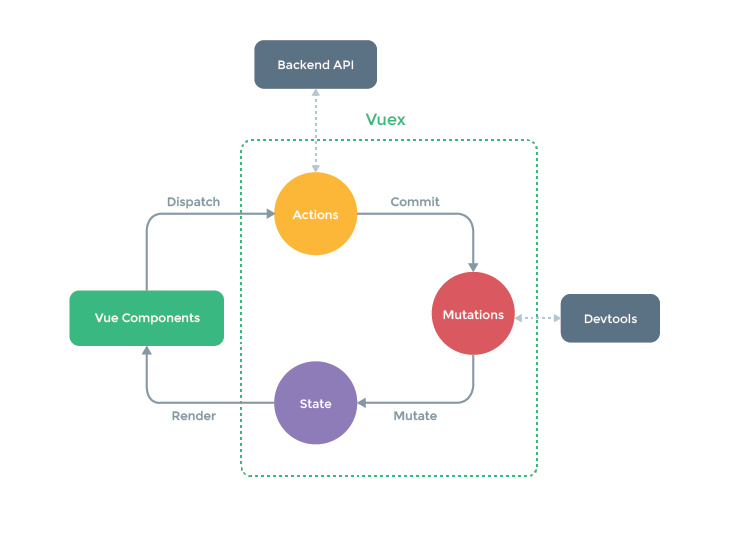

# Vuex

---
## 1.原理




## 2.使用

```js
npm i vuex
import Vuex from 'vuex'
Vue.use(Vuex)
store
vc ==> store //保证vc都可以获取到store
```

### 搭建开发环境

- 1.准备vuex

- - 安装vuex

  - 在main.js下引入、use Vuex

  - > 在store中引入Vue 、Vuex、use Vuex

- 2.准备store

- - 在src下创建一个store文件夹以及index.js文件

  - 引入Vuex 

  - 准备actions - 响应组件中的动作

  - 准备mutations - 用于操作数据

  - 准备state - 用于存储数据

  - 创建store

  - ```js
    const store = new Vuex.Store({
        actions,
        mutations,
        state,
    })
    ```

  - 暴露store

- 3.引入store

- - 在main.js下导入store

  - 在vm实例中配置store

  - > 此时可以在vm以及vc上能获取$store

### 流程

- 将数据存入state中

- 组件与actions(dispatch) - 组件将数据交给actions进行业务逻辑处理

- -  ```js
     this.$store.dispatch('fn',this.value)//组件传递value
     ```

- actions与mutations(commit) - 业务逻辑结束交给mutations处理数据

- - ```js
    //在store中的actions配置fn
    actions = {
      fn(context,value){
          //可以包裹一层业务逻辑，处理之后再commit
          context.commit('FN',value)//将value传入mutations中
      }
    }
    ```
  
- mutations与state - mutations中回调函数的第一个参数就是state

- - ```js
    //在store中的mutations配置FN
    mutations = {
       FN(state,value){
           state.data += value;//实现公共数据与传递的数据之间的加操作
      }
    }
    ```

- > 组件与mutations(commit) - 无业务逻辑直接交互
  >
  > ```js
  > this.$store.commit('FN',this.value)//组件直接与mutations对话
  > ```
  >
  > actions与actions(dispatch) - 链式业务逻辑处理
  >
  > ```js
  > actions = {
  >     fn1(context,value){
  >        context.dispatch('fn2',value) 
  >     }
  > }
  > ```
  >
  > 

### getters

- 场景/作用：多个组件需要相同操作后的数据 - 类似计算属性

- 在store中配置

- - ```js
  const getters = {
      fn(state){ //可以获取state为参数
          return state++;
      }
  }
  export default new Vuex.Store({
      getters,
  })
  
- 在组件中获取getters

- - ```js
    this.$store.getters.fn
    ```

### mapState与mapGetters

- 场景/作用：组件获取state或getters中多个数据 用计算属性简写在模板中

- 在组件的computed中配置

- - ```js
    import {mapState,mapGetters} from 'vuex'
    computed : {
        //传统写法
        state1(){
            return this.$store.state.state1;
        }
        //对象形式
        ...mapState({'state1':"state1",'state2':"state2"});
        //数组形式-简写
        ...mapState(["state1","state2",])
        //mapGetters同理
    }
    ```

### mapMutations与mapActions

- 场景/作用：生成方法

- 在组件的methods中配置

- - ```js
    import {{mapMutations,mapActions}}
    methods:{
        //传统写法
        increment(){
            this.$store.commit/dispatch('fn',value)
        }
        //对象形式
        ...mapMutations({'FN1':'FN1','FN2':'FN2'});
        //数组形式-简写
        ...mapMutations(['FN1','FN2']);
        //mapActions同理
    }
    ```

  - > 这两个方法是对commit与dispatch的实现
    >
    > 注意：使用map时生成的方法在模板中没有参数时``默认传入事件event`

## 3.Vuex的模块化编码

- 场景/作用：数据或方法的种类不同，写在同一个mutations，state...中冗余且可能发生冲突

- store中的配置

- - ```js
    const options1 = {
        namespaced:true,//在modules中命名声明
        actions:{},
    	mutations:{},
    	state:{},
    	getters:{}
    }
    export default new Vuex.Store({
        modules:{
            optionns1,
        }
    })
    ```

- 组件中

- - ```js
    computed:{
    	...mapState('options',['state1','state2'])
    }
    ```

  - 
